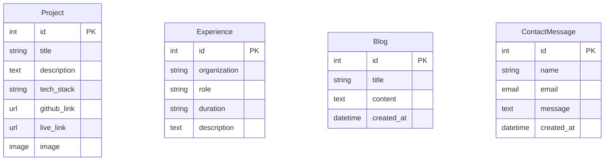
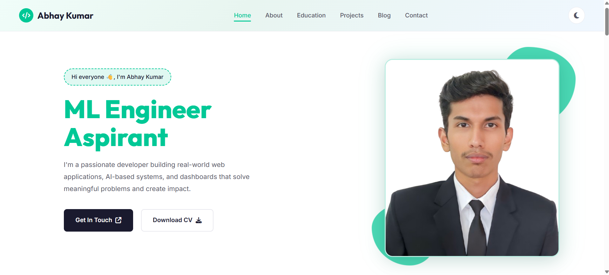
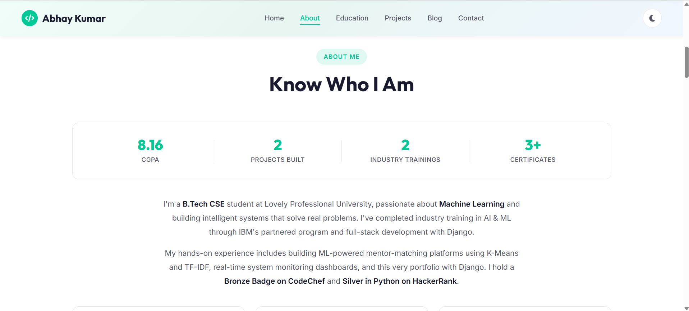
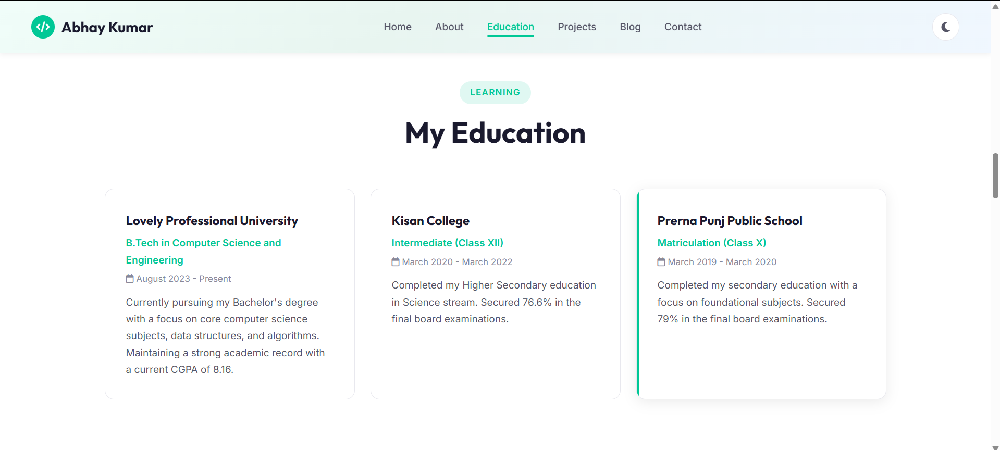
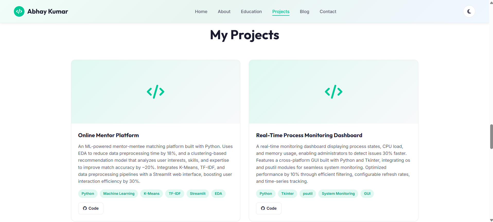
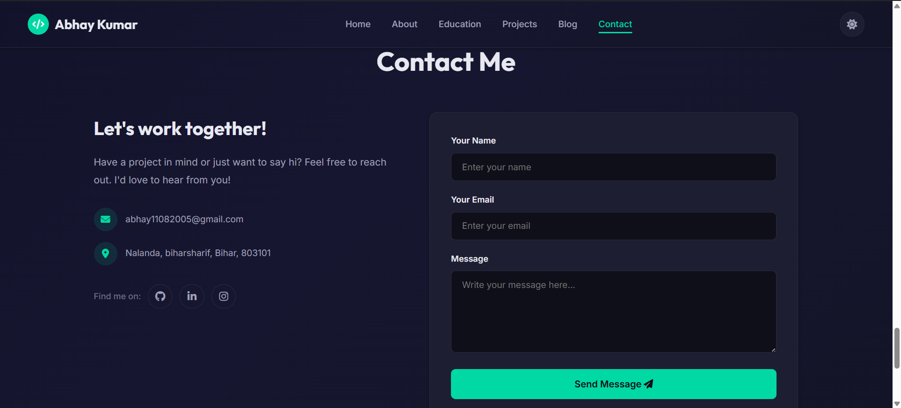
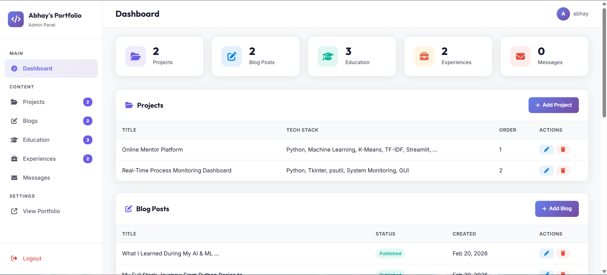

<div align="center">

# 🚀 Abhay's Portfolio

**A modern, full-stack personal portfolio website built with Django & PostgreSQL**

[](https://python.org)
[](https://djangoproject.com)
[](https://django-rest-framework.org)
[](https://postgresql.org)
[](https://github.com/abhay6205/Portfolio/actions)
[](Dockerfile)
[](LICENSE)

</div>

---

## ✨ Features

| Feature | Description |
|---------|-------------|
| 🏠 **Single-Page Home** | Hero section, about, skills, projects, experience, blog & contact — all in one |
| 💼 **Projects Showcase** | Dynamic project cards with tech stack, GitHub & live demo links |
| 📝 **Blog** | Write and publish blog posts via Django Admin |
| 📬 **Contact Form** | Accepts messages, stores in DB, sends email notifications via Gmail SMTP |
| 📧 **Email Confirmations** | Auto-sends a styled HTML thank-you email to visitors |
| 🔗 **REST API** | Full JSON API for projects, experiences, blogs & contact |
| 🔒 **Secure Config** | All credentials stored in `.env` via `python-decouple` |
| 📱 **Responsive Design** | Mobile-friendly layout with modern CSS |

---

## 🛠️ Tech Stack

| Layer | Technology |
|-------|------------|
| **Backend** | Python 3.12, Django 6.0.2 |
| **API** | Django REST Framework 3.16.1 |
| **Database** | PostgreSQL |
| **Email** | Gmail SMTP (TLS) |
| **Frontend** | HTML5, CSS3, JavaScript |
| **Config** | python-decouple (`.env`) |

---

## 📁 Project Structure

```
Portfolio/
├── .gitignore
├── .dockerignore
├── Dockerfile
├── docker-compose.yml
├── LICENSE
├── README.md
├── requirements.txt            # pip install -r requirements.txt
├── assets/
│   └── screenshots/            # App screenshots for README
│       ├── Hero_section.png
│       ├── about_me_section.png
│       ├── Education_section.png
│       ├── Project_section.png
│       ├── Contact_me_section.png
│       └── Admin_management_portal.png
├── portfolio/                  # Django project root
│   ├── .env                    # Credentials (gitignored)
│   ├── manage.py
│   ├── portfolio/              # Project settings
│   │   ├── settings.py
│   │   ├── urls.py
│   │   ├── wsgi.py
│   │   └── asgi.py
│   └── main/                   # Main app
│       ├── models.py           # Project, Experience, Blog, ContactMessage
│       ├── views.py            # Template views (HTML pages)
│       ├── api_views.py        # REST API views (JSON)
│       ├── serializers.py      # DRF serializers
│       ├── urls.py             # Page URL routes
│       ├── api_urls.py         # API URL routes
│       ├── forms.py            # Contact form
│       ├── admin.py            # Admin configuration
│       ├── templates/main/     # HTML templates
│       └── static/main/        # CSS, JS, images
└── venv/                       # Virtual environment (gitignored)
```

---

## 🚀 Getting Started

### Option A: Docker (Recommended)

The easiest way to run the project — no need to install Python or PostgreSQL manually.

**Prerequisites:** [Docker](https://docs.docker.com/get-docker/) & [Docker Compose](https://docs.docker.com/compose/install/)

```bash
# 1. Clone the repo
git clone https://github.com/abhay6205/Portfolio.git
cd Portfolio

# 2. Create the .env file (see Step 4 in manual setup below)

# 3. Build and run
docker-compose up --build
```

Visit **http://localhost:8080/** — both Django and PostgreSQL are running in containers.

To stop: `docker-compose down`
To stop and delete data: `docker-compose down -v`

---

### Option B: Manual Setup

### Prerequisites

- **Python 3.10+**
- **PostgreSQL** installed and running
- **Git**

### 1. Clone the Repository

```bash
git clone https://github.com/abhay6205/Portfolio.git
cd Portfolio
```

### 2. Create & Activate Virtual Environment

```bash
# Windows
python -m venv venv
venv\Scripts\activate

# macOS / Linux
python3 -m venv venv
source venv/bin/activate
```

### 3. Install Dependencies

```bash
pip install -r requirements.txt
```

### 4. Configure Environment Variables

Create a `.env` file inside the `portfolio/` directory (same level as `manage.py`):

```env
# Django
SECRET_KEY=your-secret-key-here

# PostgreSQL
DB_NAME=postgres
DB_USER=postgres
DB_PASSWORD=your-db-password
DB_HOST=localhost
DB_PORT=5432

# Gmail SMTP
EMAIL_HOST_USER=your-email@gmail.com
EMAIL_HOST_PASSWORD=your-gmail-app-password
```

> **💡 Tip:** To generate a Gmail App Password, go to [Google App Passwords](https://myaccount.google.com/apppasswords).

### 5. Set Up the Database

```bash
cd portfolio
python manage.py makemigrations
python manage.py migrate
```

### 6. Create a Superuser

```bash
python manage.py createsuperuser
```

### 7. Run the Development Server

```bash
python manage.py runserver
```

Visit **http://127.0.0.1:8000/** to view the site.

---

## 📡 API Endpoints

All API endpoints return JSON data and are accessible under the `/api/` prefix.

| Method | Endpoint | Description |
|--------|----------|-------------|
| `GET` | `/api/projects/` | List all projects |
| `GET` | `/api/experiences/` | List all experiences |
| `GET` | `/api/blogs/` | List all blogs (newest first) |
| `POST` | `/api/contact/` | Submit a contact message |

### Example — Fetch Projects

```bash
curl http://localhost:8000/api/projects/
```

```json
[
  {
    "id": 1,
    "title": "Nalanda Tourism Portal",
    "description": "A responsive multi-page tourism web portal",
    "tech_stack": "Next.js CSS",
    "github_link": "https://github.com/...",
    "live_link": "",
    "image": null
  }
]
```

### Example — Submit Contact Message

```bash
curl -X POST http://localhost:8000/api/contact/ \
  -H "Content-Type: application/json" \
  -d '{"name": "John", "email": "john@example.com", "message": "Hello!"}'
```

> The DRF **Browsable API** is also available — just visit the API URLs in your browser.

---

## 📖 API Documentation

Interactive API documentation is auto-generated and available at:

| URL | Format | Description |
|-----|--------|-------------|
| `/api/docs/` | **Swagger UI** | Interactive playground — try endpoints directly in the browser |
| `/api/redoc/` | **ReDoc** | Clean, readable API reference |
| `/api/schema/` | **OpenAPI 3.0 JSON** | Raw schema for code generators and tools |

---

## 📊 Data Models



---

## � Screenshots

### Hero Section


### About Me


### Education


### Projects


### Contact Me


### Admin Management Portal


---

## �🔐 Security

- ✅ All credentials stored in `.env` (gitignored)
- ✅ `SECRET_KEY`, database password, and email password are **never committed**
- ✅ Uses `python-decouple` for environment-based configuration
- ⚠️ `DEBUG = True` is for development only — set to `False` in production

---

## 📬 Email Configuration

The project sends two types of emails when someone submits the contact form:

1. **Notification Email** → Sent to you with the visitor's name, email & message
2. **Confirmation Email** → A styled HTML thank-you email sent to the visitor

Email is powered by **Gmail SMTP** with TLS encryption.

---

## 🤝 Contributing

Contributions, issues, and feature requests are welcome!

1. Fork the repository
2. Create your feature branch (`git checkout -b feature/amazing-feature`)
3. Commit your changes (`git commit -m 'Add amazing feature'`)
4. Push to the branch (`git push origin feature/amazing-feature`)
5. Open a Pull Request

---

## 📄 License

This project is licensed under the **MIT License** — see the [LICENSE](LICENSE) file for details.

---

<div align="center">

**Built with ❤️ by Abhay**

</div>
